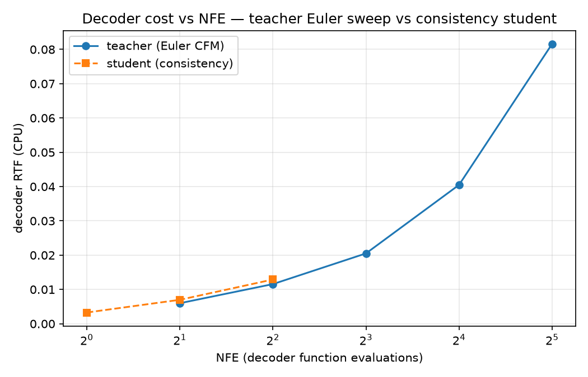

# distill-fmd — consistency distillation of a flow-matching TTS decoder

Distills Matcha-TTS's flow-matching mel decoder into a one-step student and
measures the cost/quality trade against the teacher. The efficiency axis is NFE
(number of sampling steps): the student is the same network, initialized from
the teacher, so params and memory don't change — only the step count. Nothing
is trained to convergence (not required for this task); one optimizer step
runs, and the harness reports the numbers.

Two things I'd point at first:

- **A stop-grad direction bug in the loss.** My first version put the EMA target
  on the noisier point and the trainable student at t=1. It ran and the loss
  dropped, but at t=1 the boundary parameterization makes `c_out(1)=0`, so the
  student's output there has no gradient. The true-data anchor trained nothing
  and the objective was unanchored — it would drift under real training while
  looking healthy. Fixed in `losses.py` by swapping the direction: student on
  the noisier point, EMA target on the point nearer data where `f(x,1)=x` pins
  it to real data. The held-out check below shows the one-step student tracks
  the teacher at ~0.98 mel cosine.
- **The decoder win is capped by the vocoder.** The one-step student cuts
  decoder cost ~30× (decoder RTF ~0.095 → 0.003), but total RTF only drops to
  ~0.12, because HiFi-GAN is a fixed cost that dominates once the decoder is
  below ~NFE 4. So the next thing to optimize is the vocoder, not the decoder.
  This drives the serving write-up (`writeup/serving_design.md`).

## Decisions

**Matcha, not CosyVoice 2.** Same substrate (an OT-CFM mel decoder, Euler-solved
at inference, HiFi-GAN vocoded), but pip-installable with open weights, so the
time went into the distillation and harness. The distillation only touches the
teacher through `velocity_field`, `trajectory_point`, and `encode`, so swapping
in another decoder means reimplementing those three. (I did later try CosyVoice 2
as a second teacher — see `distill-fmd(cosyvoice)/`.)

**NFE, not parameters.** Sampling steps dominate decoder latency, so cutting
32→1 attacks the main cost. The student reuses the teacher's architecture, so
params and peak memory are unchanged by design — the win is step count only.

**Consistency distillation.** Cheap per step (one teacher Euler step + two
student forwards, no full ODE solves in the loop, no multi-round schedule), it
gives a one-step sampler with a multistep knob to buy quality back at NFE 2–4,
and the boundary condition is exact by construction (`c_skip=1, c_out=1-t`, no
penalty term). Initializing from teacher weights means at step 0 the student is
"teacher extrapolated one Euler step to the endpoint," so training only has to
fix trajectory curvature.

## How to run

```bash
# once: python 3.11, espeak-ng on the system (brew install espeak-ng)
python3.11 -m venv .venv && source .venv/bin/activate
pip install -r requirements.txt

# 1. teacher sanity: text -> wav (first run downloads ~400 MB of checkpoints)
python teacher.py --text "The meeting is at 4:30 PM on March 3rd." --nfe 16

# 2. one distillation step + 60-step fresh-noise smoke loop
python train_step.py

# 3. full harness: cost + quality, teacher@{32,16,8,4,2} vs student@{1,2,4}
#    (~5-8 min on CPU; first run downloads whisper-small/ECAPA/SQUIM.
#     --skip-asr / --skip-speaker / --skip-mos drop metrics that won't load.)
python eval_harness.py
```

Outputs go to `results/`: `table.md`, `rtf_vs_nfe.png`, a few sample wavs in
`audio/`, and `student_smoke.pt` (from step 2, loaded by the harness).

## Results

12 prompts, laptop CPU (arm64), torch 2.14. The table below is one
representative run — cost columns are wall-clock and jitter ±10-15% between runs
on a shared CPU, so the stable numbers are the RTF *ratios* (~30× decoder,
~0.12 total floor). `results/table.md` holds the latest run.



### Cost

| config | NFE | params (M) | decoder s/utt | per-NFE ms | decoder RTF | total RTF | peak RSS (MB, CPU)* |
|---|---|---|---|---|---|---|---|
| teacher@32 | 32 | 11.0 | 0.475 | 14.8 | 0.0951 | 0.2231 | 1575 |
| teacher@16 | 16 | 11.0 | 0.205 | 12.8 | 0.0412 | 0.1625 | 1767 |
| teacher@8 | 8 | 11.0 | 0.102 | 12.7 | 0.0204 | 0.1332 | 1558 |
| teacher@4 | 4 | 11.0 | 0.052 | 13.1 | 0.0105 | 0.1304 | 1558 |
| teacher@2 | 2 | 11.0 | 0.026 | 13.0 | 0.0052 | 0.1154 | 1692 |
| student@1 | 1 | 11.0 | 0.016 | 16.4 | 0.0033 | 0.1162 | 1693 |
| student@2 | 2 | 11.0 | 0.030 | 14.9 | 0.0060 | 0.1258 | 1720 |
| student@4 | 4 | 11.0 | 0.054 | 13.4 | 0.0108 | 0.1293 | 1544 |

\* peak process RSS during decode, a CPU stand-in for peak VRAM (torch's
allocator caches freed memory, so later configs can look cheaper). Params are
identical across rows by design.

Per-NFE cost is a flat ~13-15 ms (same net per call), so the win is entirely
from fewer steps: student@1 is ~30× cheaper on the decoder than teacher@32.
Total RTF floors at ~0.12 because the vocoder takes over below NFE 4 —
student@1's total is basically tied with teacher@2's.

### Quality (teacher rows real; student rows are pipeline verification only)

| config | NFE | WER | CER | spk cos vs teacher@32 | MOS proxy (SQUIM) | status |
|---|---|---|---|---|---|---|
| teacher@32 | 32 | 0.099 | 0.034 | n/a | 4.336 | real baseline |
| teacher@16 | 16 | 0.099 | 0.034 | 0.996 | 4.319 | real baseline |
| teacher@8 | 8 | 0.099 | 0.034 | 0.989 | 4.288 | real baseline |
| teacher@4 | 4 | 0.099 | 0.034 | 0.977 | 4.326 | real baseline |
| teacher@2 | 2 | 0.099 | 0.034 | 0.961 | 4.331 | real baseline |
| student@1 | 1 | 0.071 | 0.016 | 0.921 | 4.103 | verification only — untrained |
| student@2 | 2 | 0.089 | 0.029 | 0.913 | 4.299 | verification only — untrained |
| student@4 | 4 | 0.071 | 0.016 | 0.897 | 4.376 | verification only — untrained |

The teacher baseline is the useful signal here: WER is flat across NFE while
speaker cosine drops monotonically (0.996 → 0.961). Intelligibility saturates;
what low-NFE loses first is speaker/timbre detail. That's the metric a distilled
student has to be gated on, and WER alone would miss it. The student rows only
confirm the metrics run — they're an untrained checkpoint, so don't read them as
a result (student WER below teacher, 0.071–0.089 vs 0.099, and speaker cosine
going the "wrong" way with step count, 0.921 down to 0.897, are both
untrained-state artefacts at n=12).

### Held-out sanity: does the one-step student track the teacher?

On 8 prompts not used in training, cosine of each one-step mel against the
teacher's 32-step solve:

| one-step predictor | cosine vs teacher@32 |
|---|---|
| student@1 (consistency map) | 0.9796 |
| naive single Euler step (init baseline) | 0.9786 |
| margin | +0.0009 |

The 0.98 says the one-step student really does track the teacher — it's not
garbage in one step. The margin over a plain Euler jump is tiny because the
student is untrained (at init it *is* teacher+one-jump); opening that margin is
what a real training run does, and it does move in the right direction with more
smoke steps. Computed by `student_teacher_agreement` in `eval_harness.py`.

## Notes and honest gaps

**Ran and verified:** teacher inference at any NFE with decoder/vocoder timing
split out; the consistency student with exact boundary and 1/2/4-step samplers;
the loss with an EMA target; one optimizer step with finite loss and non-zero
gradients; a 60-step smoke loop with fresh noise each step whose windowed loss
trends down ~67%; the held-out agreement check; the full cost/quality harness.

**Needs compute (stubbed):** the actual training run
(`train_step.py:full_training_loop` — ~100k steps, batch 32, EMA/n-grid ramps).
So every student *quality* number is verification, not a claim, and the
agreement margin is still ~0.

**Simplifications vs the full method:** constant EMA decay (no ramp), uniform
timestep sampling (no weighting toward hard t), fixed n_grid, Huber default
delta, single-round distillation. Each is flagged in `losses.py`.

**Failure modes a trained student would still risk at low NFE:** over-smoothing
(the map averages over curvature and erases fine spectral detail — fricatives,
plosive bursts — so audio muffles while WER stays OK); speaker drift (timbre is
in that same high-freq detail, so speaker cosine is the early warning); and NFE-1
artefacts from boundary regions the EMA target saw rarely, which the 2-4 step
sampler usually covers. This is why the harness keeps a MOS proxy and saved wavs
rather than trusting WER.

**Code-mixed / accent note (from actually listening).** One prompt is Hinglish
("Arre bhai … kal shaam …"). On a listen, the output is a native US-English
voice reading the Hindi words phonetically — a foreign accent, not an Indian one
("arre bhai" → "are by"). It doesn't switch to an Indian accent because it can't:
LJSpeech is a single American speaker, so there's no other accent to switch to,
and there's no prompt/speaker conditioning to change it. The harness shows this
as a number: code-mixed WER 0.25 vs 0.085 on the English prompts (~3×; the
"Code-mixed vs English" table in `results/table.md`). The limitation is in the
teacher + phonemizer, not the distillation, which is accent-agnostic — a
production Indian system swaps the teacher and leaves the method alone. And since
accent lives in the fine detail a low-NFE student over-smooths first, code-mixed
is exactly the slice the serving gate has to score separately.
